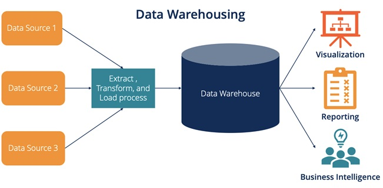
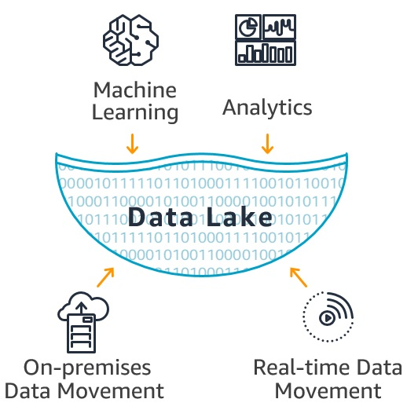
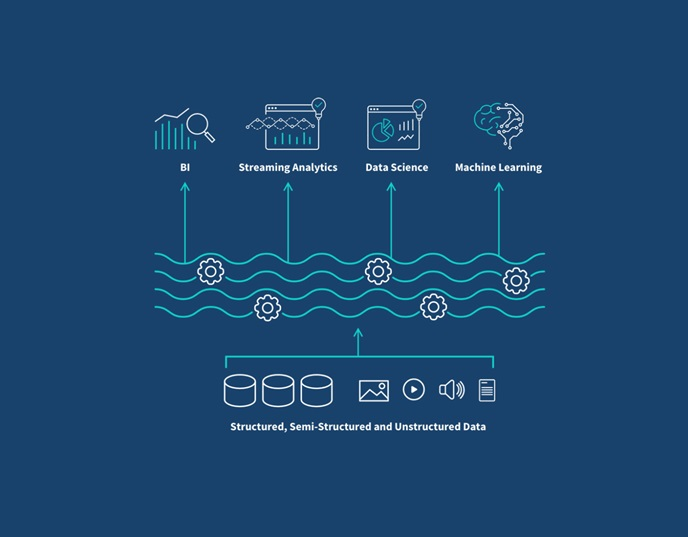

# Data Engineering Storage Abstractions

Data engineering storage abstractions are data organization and query patterns that form the foundation of the data engineering lifecycle and are developed on top of data storage systems. We'll primarily focus on abstractions that assist data science, analytics, and reporting use cases. These include data warehouses, lakes, and lakehouses. Here we summarize them.

 [Hossein KianAra](https://www.linkedin.com/in/hossein-kian-ara/), Help taken by [claude.ai](https://claude.ai/)

## Data Warehouse:

A data warehouse is a centralized repository designed for storing and managing structured data from various sources within an organization. It is optimized for querying and analysis, providing a consistent and integrated view of an organization's historical data.
Data warehouses use a predefined schema, typically following dimensional modeling techniques like star or snowflake schemas. This structure allows for efficient querying and reporting, making it ideal for business intelligence and analytics applications.
While data warehouses excel at handling structured data and supporting complex queries, they can be less flexible when it comes to accommodating new data types or rapidly changing business requirements. They also tend to be more expensive to scale compared to newer storage abstractions.

## Data Lake:

A data lake is a large-scale storage repository that holds vast amounts of raw data in its native format, including structured, semi-structured, and unstructured data. It allows organizations to store data without having to define its structure or schema upfront.
Data lakes provide flexibility and scalability, enabling organizations to ingest and store diverse data types quickly. They support a wide range of analytics use cases, including machine learning, data science, and real-time analytics, by allowing users to access and analyze data in various ways.
However, data lakes can become disorganized without proper governance, leading to what's often called a "data swamp." They also require more effort in data preparation and cleansing before analysis, as the data is stored in its raw form.

## Data Lakehouse:

A data lakehouse is a modern data management architecture that combines the best features of data warehouses and data lakes. It aims to provide the structure and performance of a data warehouse with the flexibility and scalability of a data lake.
Data lakehouses use open file formats like Apache Parquet or ORC, along with metadata layers and data management features, to create a more organized and efficient storage system. This approach enables ACID transactions, schema enforcement, and efficient querying directly on the data lake.
The data lakehouse architecture supports a wide range of workloads, from traditional business intelligence to advanced analytics and machine learning. It offers cost-effectiveness by eliminating the need for separate storage systems and data movement between platforms while still maintaining data quality and governance.

## Architectural Differences:

1. *Data Warehouse:*

- Structured, schema-on-write approach
- Typically uses a relational database management system (RDBMS)
- Often employs dimensional modeling (star or snowflake schemas)
- Data is transformed and loaded in a predefined structure (ETL process)
- Optimized for read-heavy workloads and complex queries

2. *Data Lake:*

- Schema-on-read approach
- Uses distributed file systems (e.g., HDFS) or object storage (e.g., S3)
- Stores data in its raw, native format
- Supports all data types: structured, semi-structured, and unstructured
- Decouples storage from compute resources

3. *Data Lakehouse:*

- Combines elements of both data warehouses and data lakes
- Uses open file formats (e.g., Parquet, ORC) with a metadata layer
- Implements data management features like ACID transactions and schema enforcement
- Supports both schema-on-write and schema-on-read approaches
- Enables direct querying of data lake storage

## Advantages and Disadvantages:

*Data Warehouse:*
Advantages:

- Optimized for fast query performance on structured data
- Enforces data quality and consistency
- Supports complex analytics and reporting
- Provides a single source of truth for business data

Disadvantages:

- Less flexible for handling diverse data types
- Can be expensive to scale
- Slower to adapt to changing business requirements
- Data transformation can lead to loss of raw data details

*Data Lake:*
Advantages:

- Highly flexible and scalable
- Can store any type of data in its native format
- Cost-effective for large volumes of data
- Supports a wide range of analytics use cases

Disadvantages:

- Can become disorganized without proper governance
- Requires more effort in data preparation before analysis
- May have slower query performance compared to data warehouses
- Potential for data silos and redundancy

*Data Lakehouse:*
Advantages:

- Combines benefits of both data warehouses and data lakes
- Supports diverse workloads (BI, ML, data science) on a single platform
- Provides better data governance and quality control than traditional data lakes
- Cost-effective by eliminating need for separate systems

Disadvantages:

- Relatively new concept, still evolving
- May require new skills and tools for implementation
- Potential challenges in migrating existing data warehouse or data lake architectures
- Performance may not match specialized systems for specific use cases

---

Each architecture has its strengths and is suited for different scenarios. Data warehouses excel in structured data analysis and reporting, data lakes offer flexibility for diverse data types and exploratory analysis, while data lakehouses aim to provide a balanced approach suitable for a wide range of data management and analytics needs.

---
